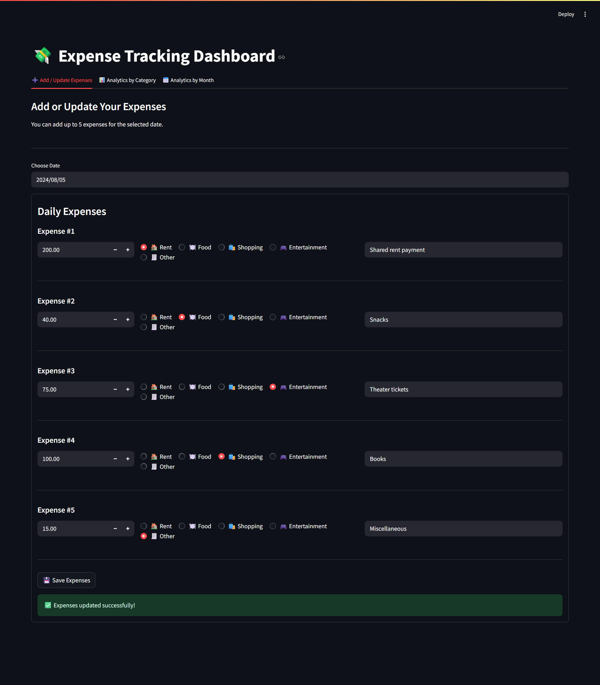
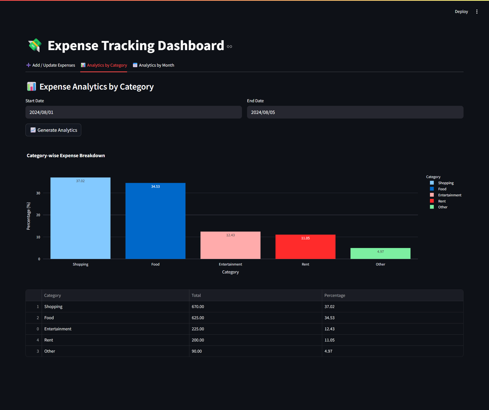
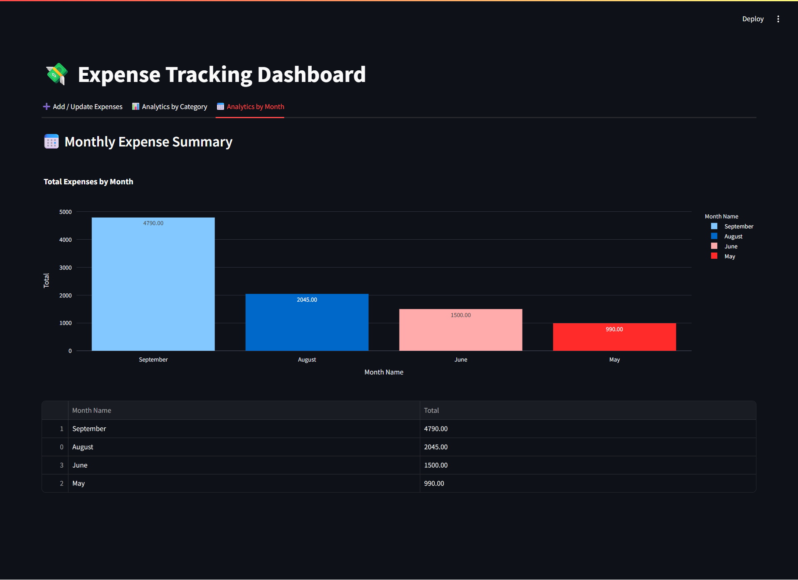

# Expense Management System

An interactive expense tracking system built with **Streamlit** for the frontend and **FastAPI** for the backend. This tool allows users to:

- 📝 Add and update daily expenses by category  
- 📊 View detailed analytics by expense category  
- 📆 Analyze monthly expense trends 

## 🛠 Features  
- User-friendly web interface built with Streamlit  
- REST API backend powered by FastAPI  
- Track expenses by categories like Rent, Food, Shopping, Entertainment, and Others  
- Visualize expense breakdown by category and by month  
- Easily extendable and customizable
- Implemented structured logging for easier debugging and monitoring
- Included unit tests for backend to ensure reliability 
- Can be run fully locally on your machine

## 🚀 How to Run Locally  
### Prerequisites:  
- Python 3.7+

1. **Clone the repository**:
   ```bash
   git clone https://github.com/vaibhavgarg2004/Expense-Tracking-System.git
   cd expense-management-system
   ```
2. **Install dependencies:**:   
   ```commandline
    pip install -r requirements.txt
   ```
3. **Run the FastAPI server:**:   
   ```commandline
    uvicorn backend.server:app --reload
   ```
4. **Run the Streamlit app:**:   
   ```commandline
    streamlit run frontend/app.py
   ```

## 📂 Project Structure

- **frontend/**: Contains the Streamlit application code.
- **backend/**: Contains the FastAPI backend server code.
- **database**: Contains the database for the application.
- **tests/**: Contains the test cases for backend.
- **requirements.txt**: Lists the required Python packages.
- **README.md**: Provides an overview and instructions for the project.

## 🖼️ Project Snapshots

Here are some screenshots of the application in action:

### 🔹 Add/Update Expenses Tab


### 🔹 Analytics by Category


### 🔹 Analytics by Month


---
Built with ❤️ using Streamlit and FastAPI

