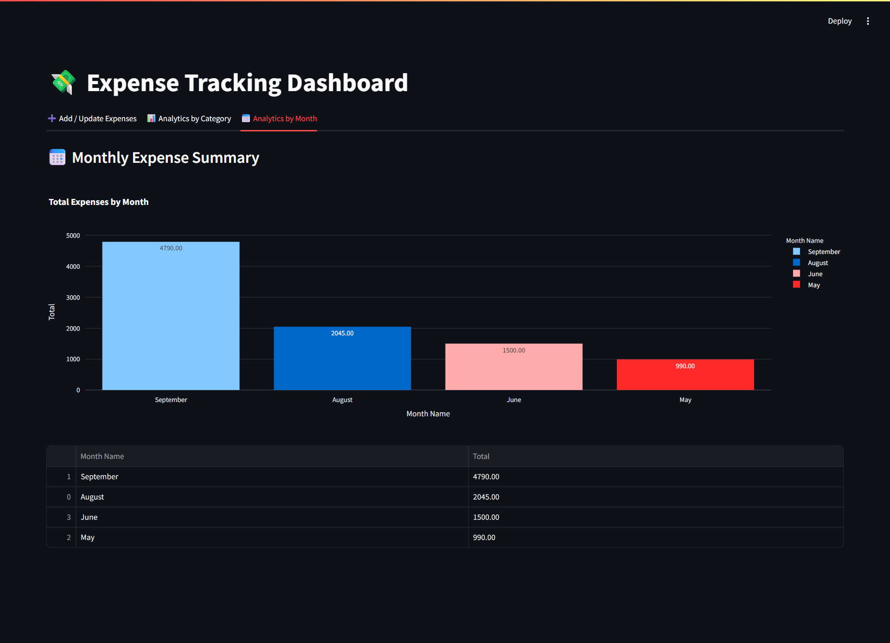

# 🧾 Expense Tracking System

An interactive expense tracking system built with **Streamlit** for the frontend and **FastAPI** for the backend. This tool allows users to:

- 📝 Add and update daily expenses by category  
- 📊 View detailed analytics by expense category  
- 📆 Analyze monthly expense trends

---

## 🎥 Presentation
Watch the full project presentation here: **[Expense Tracking System Presentation](https://vaibhav-projects.my.canva.site/expense-tracking-system)**

---

## 🛠 Features  
- User-friendly web interface built with Streamlit  
- REST API backend powered by FastAPI  
- Track expenses by categories like Rent, Food, Shopping, Entertainment, and Others  
- Visualize expense breakdown by category and by month  
- Easily extendable and customizable
- Implemented structured logging for easier debugging and monitoring
- Included unit tests for backend to ensure reliability 
- Can be run fully locally on your machine

---

## 📂 Project Structure

```
Expense-Tracking-System/
│
├── frontend/  
│   ├── add_update.py              # Streamlit component for adding/updating expenses  
│   ├── analytics_by_category.py   # Streamlit component for category-wise analysis  
│   ├── analytics_by_months.py     # Streamlit component for monthly analysis  
│   └── app.py                     # Main Streamlit app entry point  
│
├── backend/  
│   ├── db_helper.py               # MySQL interaction logic  
│   ├── logging_setup.py           # Logger configuration  
│   ├── server.py                  # FastAPI application  
│   └── server.log                 # Runtime logs (can be ignored or added to .gitignore)  
│
├── database/  
│   └── expense_db_creation.sql    # MySQL schema and sample data  
│
├── tests/  
│   ├── conftest.py                # Pytest configuration  
│   └── backend/  
│       └── test_db_helper.py      # Unit tests for database helper  
│
├── LICENSE                        # Apache License file  
├── requirements.txt               # Project dependencies  
└── README.md                      # Project documentation 
```

---

## 🚀 How to Run Locally  
### Prerequisites:  
- Python 3.7+
- MySQL 8.0+

1. **Clone the repository**:
   ```bash
   git clone https://github.com/vaibhavgarg2004/Expense-Tracking-System.git
   cd Expense-Tracking-System
   ```
2. **Install dependencies**:   
   ```commandline
    pip install -r requirements.txt
   ```
3. **Set up the MySQL database**
 
   - **Import the schema and sample data:**

     Open **MySQL Workbench**, connect to your MySQL server, and use the following steps to import the database schema:

      1. Go to **File > Open SQL Script**.
      2. Navigate to the SQL file located at `database/expense_db_creation.sql` in the project folder.
      3. Open the file, then click the **Execute** button (⚡) to run the script and create the database with sample data.

   - **Update your MySQL credentials**:  
     Open the file `backend/db_helper.py` and update the following variables with your MySQL username and password:
     
     ```python
     user = "your_mysql_username"
     password = "your_mysql_password"
     ```
4. **Run the FastAPI server**:   
   ```commandline
    uvicorn backend.server:app --reload
   ```
5. **Run the Streamlit app**:   
   ```commandline
    streamlit run frontend/app.py
   ```

---

## 🖼️ Project Snapshots

Here are some screenshots of the application in action:

### 🔹 Add/Update Expenses Tab


### 🔹 Analytics by Category


### 🔹 Analytics by Month


---

## 📄 License
This project is licensed under the **Apache License 2.0**. See the [LICENSE](./LICENSE) file for details.

---

*Spend wiser. Track expenses effortlessly.*

